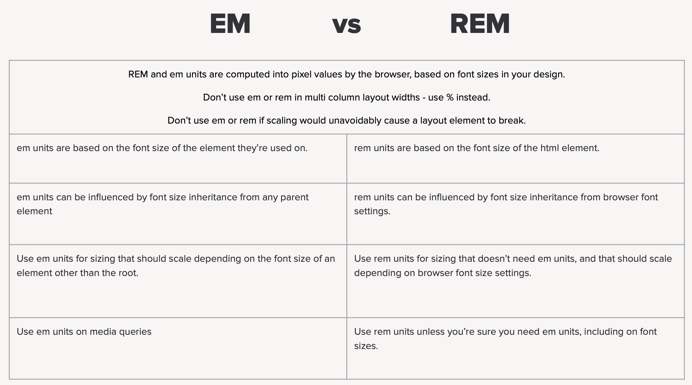

# Vienetai (ang. units) naudojami CSS

Absoliutus vienetai:
---
* pikseliai (px - 1px = 1/96th of 1 in))
* points (points (1pt = 1/72 of 1 in))
* in (inches)
* cm (centimetras)
* ir t.t.

Santykiniai vienetai:
---
* em - relative to the font-size of the element (2em means 2 times the size of the current font)
* rem - relative to font-size of the root element

Dažnai yra naudojami relatyvus vienetai rem ir em (apie juos daugiau, sekančioje skaidrėje).

*Both rem and em are relative units, px is not. Before considering rem, it’s important to understand the relationship between em, markup and inheritance.*

[https://j.eremy.net/confused-about-rem-and-em/](https://j.eremy.net/confused-about-rem-and-em/)

* procentai (%)
* vh - 1 vh yra reliatyvus vienam procentui viewport aukščio (ang. relative to 1% of the height of the viewport)
* vw - 1 vw yra reliatyvus vienam procentui viewport pločiui (ang. relative to 1% of the width of the viewport)
* grid layout naudojami fr (fraction)
  