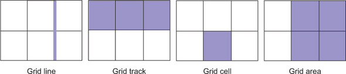

# Grid anatomija

* Grid line—These make up the structure of the grid. A grid line can be vertical or horizontal and lie on either side of a row or column. The grid-gap, if defined, lies atop the grid lines.
* Grid track—A grid track is the space between two adjacent grid lines. A grid has horizontal tracks (rows) and vertical tracks (columns).
* Grid cell—A single space on the grid, where a horizontal grid track and a vertical grid track overlap.
* Grid area—A rectangular area on the grid made up by one or more grid cells. The area is between two vertical grid lines and two horizontal grid lines.

