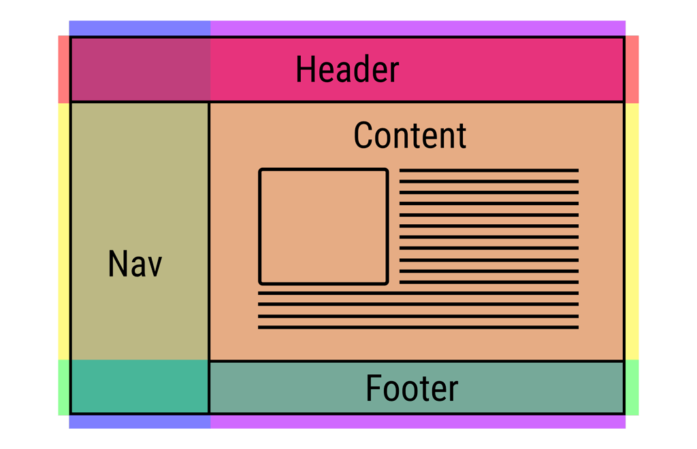

# Grid panaudojimo pavyzdis III

Sekantis žingsnis yra apibrėžti/nusakyti mūsų tinklelio (ang. grid) stulpelius (ang. columns) ir eilutes (ang. rows).

Paprastumo dėliai, mes implementuosime mūsų layout taip:

---

---