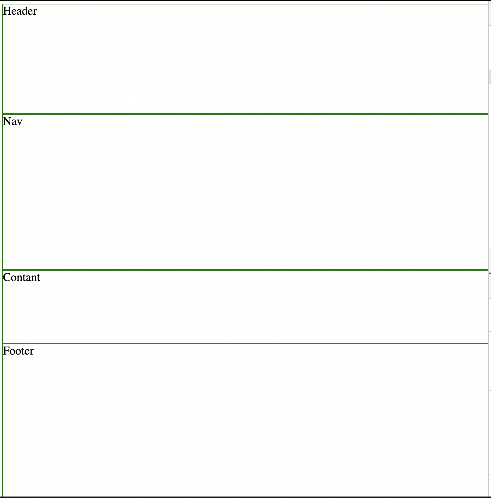

# Grid panaudojimo pavyzdis IV

Kai naudojame CSS grid ir nusakome eilutes (ang. columns) arba stulpelius (ang. rows) tai toks veiksmas vadinamas `set of tracks`.

Apibrėžkime mūsų eilutes (ang. rows)

```css
html, body {
    width: 100vw;
    min-height: 100vh;
    margin: 2px;
    padding: 0;
}

body {
    display: grid;
    grid-template-rows: 150px auto 100px;
}

body > * {
    border: 1px solid green;
}
```

---

