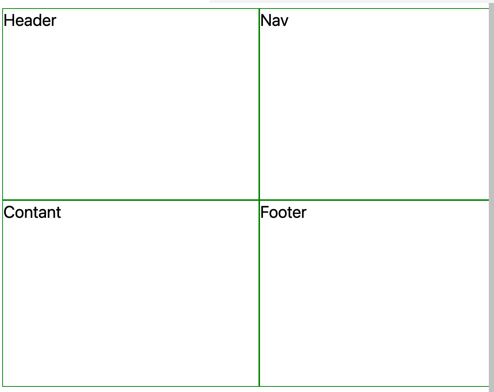

# Grid panaudojimo pavyzdis V

Dabar mes turime apibrėžti stulpelių dydžius:

```css
body {
    display: grid;
    grid-template-rows: 150px auto 100px;
    grid-template-columns: minmax(200px, 3fr) 9fr;
}
```

---



Kaip matote, mūsų layout vis dar nėra toks kokį mes norėjome gauti. Visa tai del to, kad mes nepriskiriame mūsų elementus stulepaliams (ang. columns) ir eilutėms (ang. rows)