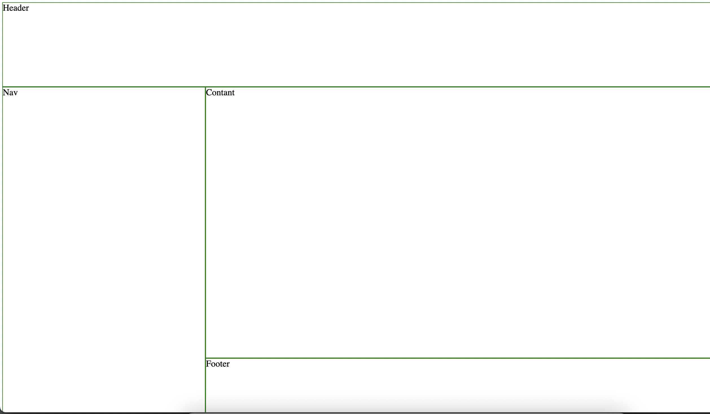

# Grid panaudojimo pavyzdis VI

Tam, kad mūsų elementai būtų teisingai atvaizduoti mūsų layout, mes turime juos priskirti tam tikroms sritims (rows ir columns).

```css
/*
    We want our header to start in the first column and end before the 3rd column.
*/
header {
  grid-column: 1 / 3;
}

/*
    Our nav should start in the second row and span 2 rows in total.
*/
nav {
  grid-row: 2 / span 2;
}
```

---

