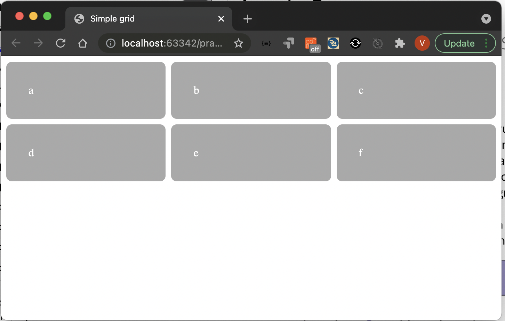
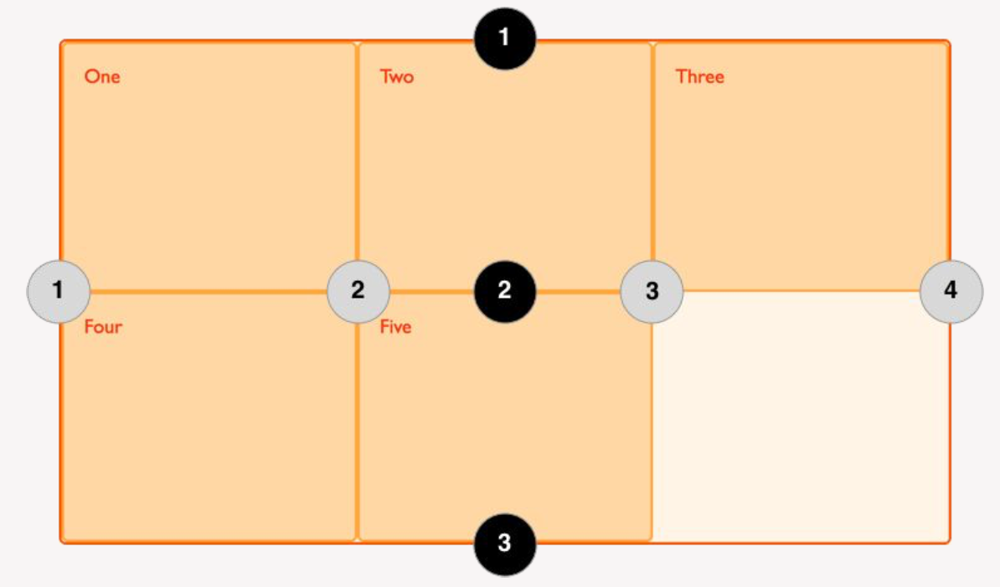

# Elementų išdestymas grid


```css
.grid {
  display: grid;
  grid-template-columns: 1fr 1fr 1fr;
  grid-template-rows: 1fr 1fr;
  grid-gap: 0.5em;
}

.grid > * {
  background-color: darkgray;
  color: white;
  padding: 2em;
  border-radius: 0.5em;
}
```

```html
<div class="grid">
  <div class="a">a</div>
  <div class="b">b</div>
  <div class="c">c</div>
  <div class="d">d</div>
  <div class="e">e</div>
  <div class="f">f</div>
</div>
```

---


---

```css
.wrapper {
  display: grid;
  grid-template-columns: repeat(3, 1fr);
  grid-auto-rows: 100px;
}
.box1 {
  grid-column-start: 1;
  grid-column-end: 4;
  grid-row-start: 1;
  grid-row-end: 3;
}
.box2 {
  grid-column-start: 1;
  grid-row-start: 3;
  grid-row-end: 5;
}
```

---



